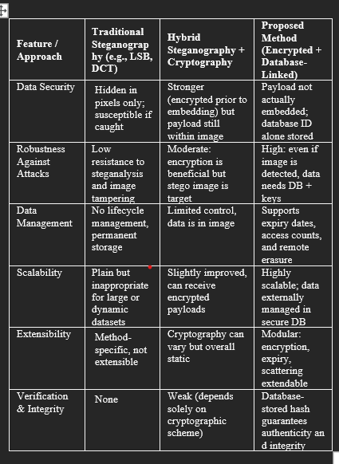
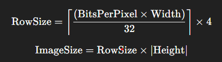
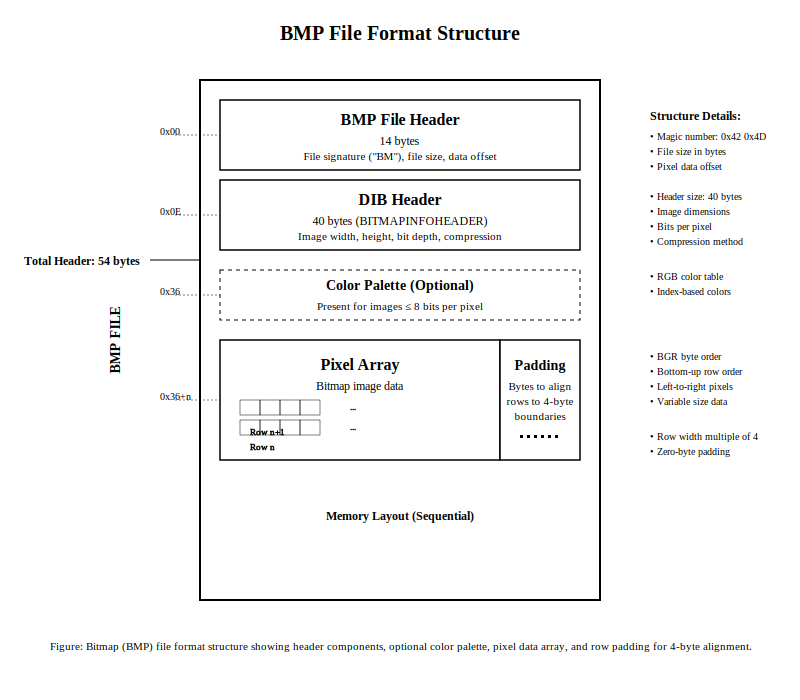
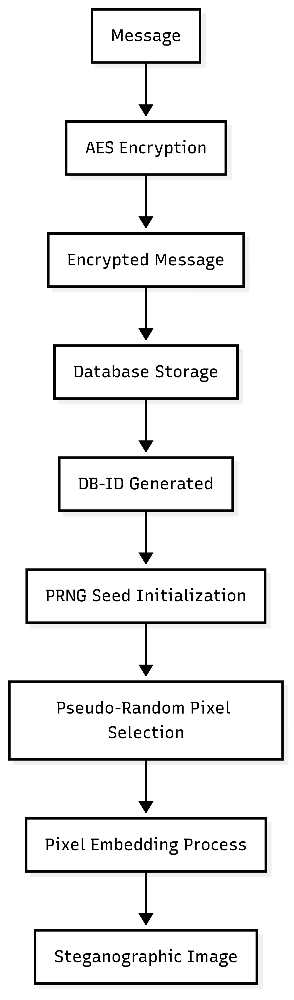
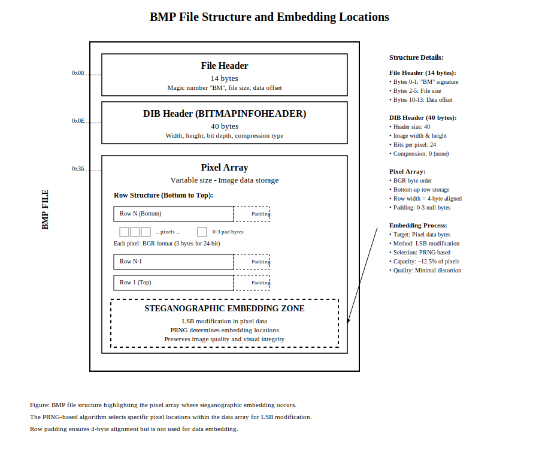
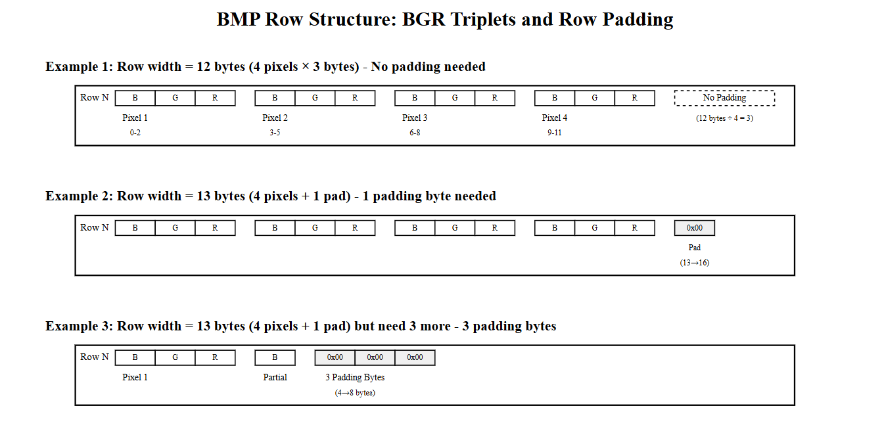

# abstract

Secure transmission of sensitive data continues to be an ongoing problem in the age of cyberspace, where enemies are constantly developing new monitoring and eavesdropping methods. Although cryptography can provide confidentiality, the very existence of ciphertext tends to draw attention and focused attacks. Steganography hides information inside digital media, providing deniability. Nevertheless, standard image steganography techniques like least significant bit (LSB) substitution usually insert static payloads, thereby compromising on imperceptibility, making them vulnerable to steganalysis, and offering poor security against long-term exposure.

This paper aims to overcome these limitations by introducing a hybrid system that combines:

1. AES encryption of payloads using auto-expiring keys obtained by PBKDF2.

2. 24-bit BMP image preprocessing with padding tweaks for uniform pixel mapping in top-down and bottom-up formats.

3. PRNG-driven embedding with Linear Congruential Generator (LCG) and SHA-256–based pseudo-random schemes to distribute embedding locations, enhancing security and reducing statistical artifacts.

4. Database-referenced embedding, wherein only lightweight identifiers are embedded in the image but encrypted data, integrity hashes, and expiry metadata are stored securely externally.

During decoding, the hidden identifier is retrieved, checked for expiry and integrity conditions, and decrypted if access restrictions are still valid. Experimental testing proves that the introduced framework provides a useful tradeoff between imperceptibility, resilience, and security. It also enhances steganography's potential for use in confidential communication, digital forensics, intellectual property protection, and digital rights management.

Keywords— Image steganography, AES encryption, LCG PRNG, SHA-256 PRNG, auto-expiring keys, database-referenced embedding, 24-bit BMP preprocessing, secure digital communication.

---

# introduction

The historic expansion of online connectivity has been paralleled by a growth in information security threats. Confidential messages are often intercepted, tapped, or intercepted, highlighting the need for secure transmission protocols. Cryptography has been the basis of digital security, transforming plaintext into incomprehensible ciphertext and thus providing confidentiality. The apparent visibility of encrypted data itself can, however, imply the presence of covert communication, potentially attracting hostile attention or attack.

Steganography overcomes the above constraint by hiding information inside apparently harmless carriers like images, audio, or video. Images, because of their high redundancy and extensive use, are the most popular medium used for steganographic purposes. Traditional methods, especially least significant bit (LSB) substitution, allow payload insertion with minimal perceptual loss. Although very effective in straightforward environments, these techniques have main disadvantages. Direct embedding of static payloads makes it more vulnerable to statistical steganalysis, use of long-term static keys leaks hidden data in case of compromise, and lack of fine-grained access control permits undeterred reuse of derived data.

To transcend such constraints, this work suggests a hybrid image steganography system that combines encryption, database-managed storage, and time-varying access control. In contrast to conventional schemes, only a light reference—a database identifier—is hidden in the image. The identifier is a pointer to externally stored encrypted material, along with integrity hashes, expiration dates, and usage counts. Through externalization of payload storage, the carrier image eschews direct visibility of vulnerable ciphertext, thus mitigating widespread compromise.

A second innovation of the system under proposal is the use of auto-expiring keys and access policy controls. Instead of using static encryption keys, the model has temporal validity and usage controls, in effect providing self-destructing hidden data. The mechanism stops unauthorized reuse and minimizes long-term exposure, which makes the strategy applicable to applications such as temporary authentication, secure messaging, and digital rights management.

To further improve security, a pseudo-random scattering scheme is proposed, dispersing the embedded database reference in multiple image areas. In contrast to basic sequential LSB replacement, this approach decreases predictability and lowers statistical artifacts, thus enhancing robustness to steganalysis.

The major contributions of this research can be outlined as follows:

1. A hybrid embedding model that integrates encryption, external database storage, and database-referenced identifiers to minimize payload exposure in carrier images.

2. A time- and usage-limited key management system for auto-expiring, self-destructing hidden data.

3. A pseudo-random scattering method enhancing the imperceptibility and steganalysis robustness.

4. Exemplified applicability to numerous fields, ranging from confidential communication to digital forensics, intellectual property protection, and safe information sharing.

---
# Related Work 

Bhatnagar et al. [1] present a combined compression–encryption–steganography pipeline that compresses secret text (LZ algorithm), encrypts it (RSA), and embeds it using LSB insertion. The use of compression reduces payload size and RSA encryption improves confidentiality prior to embedding, which together boost capacity and secrecy. However, because the ciphertext is still embedded in the image, the scheme remains exposed to statistical steganalysis and lacks temporal or externalized access controls.

Mangena and Malik [2] perform a comparative study of image-text steganographic methods across formats (JPEG, PNG, BMP) and conclude that format choice significantly affects embedding effectiveness; their PSNR/SSIM analysis suggests JPEG and BMP as favorable formats for image-text steganography. The work is valuable for matching methods to formats, but it is a survey-level contribution and does not propose lifecycle controls, PRNG-driven scattering, or cryptographic key-management improvements.

Jabeen and Wahid [3] propose a hybrid method that encrypts the secret message using a PRNG-generated key and two-stage XOR before embedding with a transformation-based (3-3-2 RGB) approach. Their approach demonstrates improved imperceptibility and robustness through per-character randomness. Nevertheless, XOR-based encryption limits cryptographic strength compared with modern ciphers (e.g., AES), and the method does not incorporate external storage or time-bound keys.

Tang [4] conducts an exhaustive analysis of Linear Congruential Generators (LCGs) under multiplier restrictions and identifies parameter sets with better spectral-test performance for bit sizes b = 8–31. This theoretical groundwork informs the selection of LCG parameters for secure embedding location generation. The study is focused on PRNG properties rather than a direct application in image steganography, so additional evaluation is needed to map spectral-test gains to reduced detectability in real stego pipelines.

Agrawal and Ahuja [5] propose CSIS, a compressed-sensing-based steganography scheme that sparsifies image blocks, selectively embeds encrypted bits into permissible measurements, and reconstructs stego-images via LASSO. The method achieves higher embedding capacity with competitive visual quality metrics (PSNR, SSIM) and resists statistical distortion. Its reliance on compressed sensing and optimization for reconstruction introduces computational complexity and departs from simple LSB-style embedding, which can be both strength and implementation overhead depending on constraints.

Al-Faydi et al. [6] introduce an improved LSB technique that first compresses secret bits (LZW) and embeds them in edge pixels whose bit patterns match, producing near-perfect cover–stego matching (claimed ideal PSNR/SSIM). The location-address mapping provides lossless recovery and exceptional imperceptibility for tested images. However, the reliance on pixel-address sidecar data (location addresses) requires secure transfer or storage of that metadata and reduces practicality when only a single self-contained stego image is desired.

Patil and Sonaje [7] implement “Crypto-Stego,” coupling AES encryption with LSB embedding to provide a straightforward secure pipeline for hiding text/files in images. The combination brings modern symmetric cryptography to LSB steganography and improves confidentiality. While effective, the approach embeds full ciphertext directly into the image and does not address temporal key expiry, externalized payload management, or PRNG-driven scattering to lower steganalysis detectability.

Ahmed [8] provides a systematic overview of secure image steganography, cataloguing common stego algorithms (notably LSB) and cryptographic pairings (AES, Blowfish), and reporting comparative PSNR results (e.g., high PSNR for LSB+hash/RSA). The survey consolidates existing design patterns and metrics, aiding method selection, but as a literature review it does not introduce new lifecycle or database-referenced techniques.

Nezami et al. [9] propose a hash-driven multi-LSB encoding method that encrypts plaintext and substitutes up to four LSBs guided by a cryptographic hash to increase unpredictability. Reported results show favorable MSE/PSNR trade-offs versus baselines, demonstrating that hash-based selection increases imperceptibility. Still, the full ciphertext remains embedded inside the carrier and the scheme lacks temporal access controls or external payload storage.

Laskar and Hemachandran [10] describe a DCT-based (frequency-domain) JPEG steganography scheme combined with substitution encryption in the transform domain. Embedding in DCT coefficients preserves visual and many statistical properties after insertion and can be resilient to certain processing steps. The frequency-domain approach is effective for JPEG carriers, but it differs fundamentally from 24-bit BMP/LSB workflows and does not provide database-referenced identifiers or auto-expiring key semantics.

---

# COMPARISON WITH PREVIOUS METHODOLOGY

> keep the previous table as is (TABLE)

Traditional steganographic schemes such as Least Significant Bit (LSB) substitution and Discrete Cosine Transform (DCT) embedding directly insert payloads into pixel values. While lightweight and computationally efficient, these methods are highly vulnerable to steganalysis and accidental corruption during compression or editing. Moreover, once extracted, the hidden message lacks confidentiality safeguards.

Hybrid techniques improve upon this by encrypting the payload before embedding. This ensures that unauthorized access to the raw stego image does not immediately disclose the hidden message. However, the encrypted payload remains part of the image, which continues to be a high-value target. Additionally, such methods generally lack lifecycle controls, meaning the embedded data can persist indefinitely without restrictions.

The proposed methodology advances the paradigm by embedding only a database reference identifier within the carrier image. The actual encrypted payload, integrity hashes, and access control metadata are maintained externally. Consequently, interception of the carrier image alone does not enable message reconstruction without access to the secure database and corresponding cryptographic keys. Furthermore, the system supports expiry times and usage-based access quotas, ensuring that keys self-invalidate, thereby enforcing automatic destruction of sensitive information. This combination of externalized storage, policy enforcement, and scattering of embedded references provides not only stronger robustness against attacks but also usability in contexts such as secure communication, temporary data exchange, and compliance-driven information sharing.

# Proposed Framework
### I. System Overview
The proposed framework for secure image steganography departs from traditional concealment techniques by introducing a decoupled embedding and storage mechanism. Instead of embedding the full ciphertext within the image, only a database identifier (DB-ID) is encoded, while the actual encrypted payload, access restrictions, and integrity metadata are stored externally in a secure database. This design achieves higher scalability, tamper resistance, and flexible data lifecycle management.

#### A. Architectural Overview

1. The framework consists of the following main modules:

Image Preprocessing and Conversion
Input files of arbitrary formats (JPEG, PNG, etc.) are first converted into 24-bit BMP images. BMP is chosen for its uncompressed pixel storage, predictable padding structure, and resistance to lossy compression artifacts. The pixel data is accessed directly in the order defined by the BMP header, enabling precise Least Significant Bit (LSB) manipulations.

For a BMP image, the number of bytes per row is padded to the nearest multiple of 4.

This ensures alignment and predictable access offsets.

> (Image to include): A schematic of BMP file architecture highlighting Header (54 bytes), DIB information, Pixel Array, and Padding.

2. Payload Encryption and Key Derivation

The secret message is encrypted using AES (128/256-bit), with the encryption key derived from a user-supplied password via PBKDF2 and a cryptographic salt:

> Formula 2,,, **`K = PBKDF2(Password,Salt,Iterations,KeySize)`**

This guarantees strong resistance against brute-force attacks.

In addition, a SHA-256 hash of the image pixel data is computed for integrity verification:

> Formula 3,,, **`H = SHA-256(Image pixel data)`**

Both the ciphertext and hash are stored in the external database, bound to a unique identifier.

3. Encoding Metadata in the Image

To make the stego process extensible and verifiable, the first three bytes of the pixel array are reserved as encoding check flags. These act as “magic bytes” to confirm that the carrier image indeed contains hidden information.

Example encoding pattern:

Byte[0] = 0x53 (‘S’)

Byte[1] = 0x54 (‘T’)

Byte[2] = 0x47 (‘G’)

Thus, the prefix `“STG”` indicates a steganographic image.

4. Database Identifier Embedding via LSB + PRNG

The DB-ID (instead of ciphertext) is embedded using pseudo-randomly selected pixels. Two approaches are implemented:

Linear Congruential Generator (LCG):
>Formula 4,,, **`Xn+1 ​= (aXn ​+ c) mod m`**

where 
a, c, and 𝑚 are carefully chosen constants for maximal cycle length.

SHA-256 Based PRNG:
Each next position is computed as:

>Formula 5,,, **`Pi=SHA-256 (Seed ∥ i) mod N`**

where 𝑁 is the number of embeddable pixel positions.

By randomizing embedding positions, the system resists statistical steganalysis.

<!--  -->

#### B. Decoupled Storage and Retrieval

During retrieval, the DB-ID is extracted from pseudo-random positions, validated against the encoding check flags, and then used to fetch the ciphertext and hash from the database. The system enforces expiry times and access counters, ensuring that decryption keys automatically expire after conditions are met.

### II. Image Considerations

In steganography, the choice of carrier image is fundamental to both robustness and imperceptibility. This work employs 24-bit Bitmap (BMP) images as the cover medium due to their uncompressed nature, straightforward architecture, and predictable pixel storage scheme. Unlike JPEG or PNG formats, which rely on lossy or entropy-based compression, BMP images preserve every byte of pixel data, thereby reducing the risk of information distortion during embedding and extraction.

#### A. BMP File Architecture

A standard 24-bit BMP image consists of three main regions:

1. File Header (14 bytes) – identifies the file as a BMP and stores metadata such as file size and offset to pixel data.

2. DIB Header (40 bytes in BITMAPINFOHEADER) – contains image width, height, color depth, and compression type (for 24-bit BMP, compression is typically BI_RGB, meaning none).

3. Pixel Data Region – stores image data row by row, where each pixel is represented by 3 bytes (Blue, Green, Red).

#### B. Pixel Representation

For a 24-bit BMP, each pixel is represented as:
 > Formula 6 **`Pixel(x,y) = {Bx,y​, Gx,y​, Rx,y​}`**

 where each channel is 8 bits. This uniformity simplifies Least Significant Bit (LSB) modification without introducing significant perceptual change.

#### C. Row Padding

Each row of pixel data in BMP is padded to ensure its size is a multiple of four bytes. The padding formula is:

> Formula 7 **`Padding = (4 − (Width × 3 mod 4 )) mod 4`**

This ensures alignment of pixel rows in memory. While padding bytes are generally ignored by image renderers, they can be strategically used in steganography either as embedding redundancy or as resistance against naïve extraction attacks.

#### D. Resistance and Suitability

BMP images provide several advantages in steganography:

- No Compression: Unlike JPEG (lossy) and PNG (entropy-coded), BMP avoids compression artifacts that may corrupt hidden data.

- Predictable Structure: The fixed header and row alignment simplify embedding algorithm design.

- Steganalysis Resistance: The redundancy from padding and the direct pixel access provide flexibility to scatter hidden bits pseudo-randomly, strengthening resistance against statistical steganalysis.

- For these reasons, BMP images serve as an ideal medium in the proposed framework.

### III. Encoding Strategy

The encoding process in the proposed framework balances imperceptibility, robustness, and controlled retrieval. This is achieved through a three-step methodology: (i) header reservation and metadata encoding, (ii) Least Significant Bit (LSB) substitution, and (iii) pseudo-random scattering of embedded bits via Linear Congruential Generator (LCG) and SHA-256 based Pseudo-Random Number Generator (PRNG).

#### A. Reserved Header Bytes for Validation

The first three bytes of pixel data are reserved as a steganographic signature. These bytes encode a predefined constant (e.g., `"STE"` or `0x53 0x54 0x45`) to verify the presence of hidden data before extraction.

> Formula 8,,, **`H = {P1​, P2​, P3​} where Pi ​∈ Pixel Data`**

If 𝐻 ≠ Signature, the decoder halts, preventing unnecessary computation.

# References 

[1] A. Bhatnagar, S. Chaku, and M. Sainger, “Hiding Compressed and Encrypted Data by using a Technique of Steganography,” International Journal of Engineering Research & Technology (IJERT), vol. 9, no. 4, Apr. 2020. [Online]. Available: http://www.ijert.org
.

[2] V. M. Mangena and R. Malik, “Comparative Study on Data Embedding Techniques in Image Text-Based Steganography,” in Communications in Computer and Information Science, Jun. 2021. [Online]. Available: https://www.researchgate.net/publication/352540188
.

[3] H. Jabeen and A. Wahid, “Image Steganography using Pseudo Random Number Generator,” International Journal of Advanced Research in Computer Engineering & Technology (IJARCET), vol. 8, no. 3, Mar. 2019, ISSN: 2278–1323.

[4] H.-C. Tang, “An Analysis of Linear Congruential Random Number Generators when Multiplier Restrictions Exist,” European Journal of Operational Research, Feb. 2007. doi: 10.1016/j.ejor.2006.08.055.

[5] R. Agrawal and K. Ahuja, “CSIS: compressed sensing-based enhanced-embedding capacity image steganography scheme,” arXiv preprint, arXiv:2101.00690, Jan. 2021.

[6] S. N. M. Al-Faydi, S. K. Ahmed, and H. N. Y. Al-Talb, “Improved LSB image steganography with high imperceptibility based on cover-stego matching,” IET Image Processing, vol. 17, pp. 2072–2082, 2023. doi: 10.1049/ipr2.12773.

[7] H. V. Patil and V. P. Sonaje, “Crypto-Stego: A Hybrid Method for Encrypting Text Messages or Text Files within Images Using AES and LSB Algorithms,” International Journal of Intelligent Systems and Applications in Engineering, vol. 12, no. 235, pp. 2780–2793, 2024.

[8] B. T. Ahmed, “A systematic overview of secure image steganography,” International Journal of Advances in Applied Sciences (IJAAS), vol. 10, no. 2, pp. 178–187, Jun. 2021.

[9] Z. I. Nezami, H. Ali, M. Asif, H. Aljuaid, I. Hamid, and Z. Ali, “An efficient and secure technique for image steganography using a hash function,” PeerJ Computer Science, vol. 8, e1157, 2022. doi: 10.7717/peerj-cs.1157.

[10] S. A. Laskar and K. Hemachandran, “Secure Data Transmission Using Steganography and Encryption Technique,” International Journal on Cryptography and Information Security (IJCIS), vol. 2, no. 3, Sep. 2012.

# selected paper titles (actual) (dont include in paper)
1.  Hiding Compressed and Encrypted Data by 
using a Technique of Steganography -
2. Comparative Study on Data Embedding Techniques 
in Image Text-Based Steganography -
3. A systematic overview of secure image steganography -
4. SECURE DATA TRANSMISSION USING
 STEGANOGRAPHY AND ENCRYPTION
 TECHNIQUE -
5. compressed sensing-based
 enhanced-embedding capacity image
 steganography scheme -
6. Improved LSB image steganography with high imperceptibility
 based on cover-stego matching -
7. Crypto-Stego: A Hybrid method for Encrypting  Text Messaging  or Text Files within images using AES and LSB algorithms -
8. An analysis of linear congruential random number
 generators when multiplier restrictions exist (n) - 
9. An efficient and secure technique for
 image steganography using a hash
 function (n) -
10. Image Steganography using Pseudo Random 
Number Generator (n) -